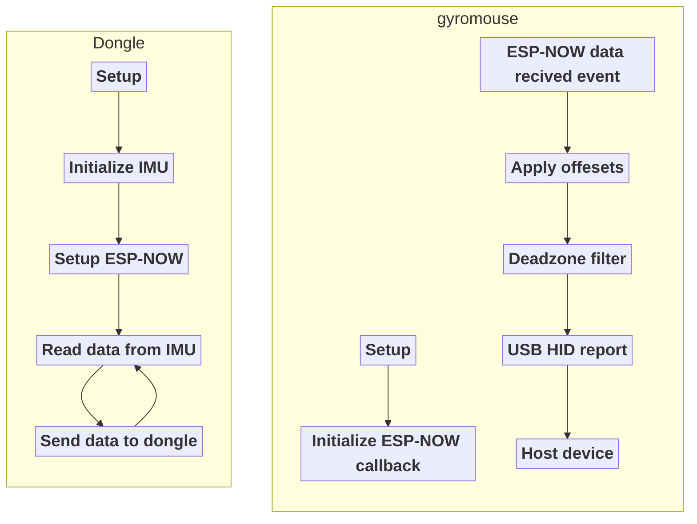

```mermaid
%%{init: {"theme": "default", "themeVariables": {"fontSize": "20px"}}}%%
%%{init: {'flowchart': {'padding': 3}}}%%
flowchart TD
    subgraph gyromouse
     direction TB
    A[<b>Setup] --> B[<b>Initialize ESP-NOW callback</b>]
    
    C[<b>ESP-NOW data recived event]

    C --> D[<b>Apply offesets]
    D --> F[<b>Deadzone filter]
    F --> G[<b>USB HID report]
    G --> H[<b>Host device]
    end
    subgraph Dongle
    direction TB
    Aa[<b>Setup] --> Bb[<b>Initialize IMU]
    Bb --> Cc[<b>Setup ESP-NOW]
    Cc --> Dd[<b>Read data from IMU]
    Dd --> Ff[<b>Send data to dongle]
    Ff --> Dd
end

```
