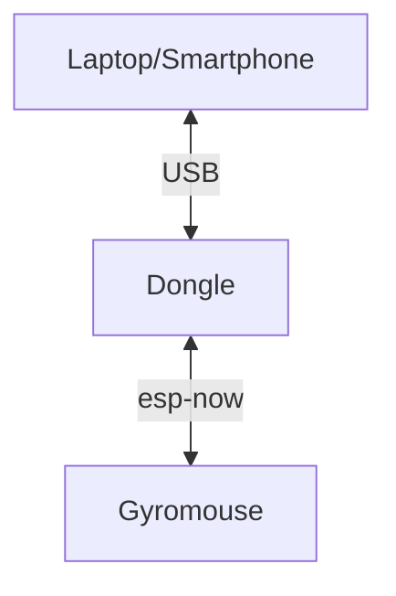

# Assistive device for using a computer without a mouse (gyromouse)

## Overview

This device aims to help people control their computer mouse pointer when they cannot use a standard computer mouse, it does this by tracking the user's head movement with an onboard Inertial Measurement Unit (IMU) module. The device also features a wireless dongle that allows it to connect to any device by mimicking a standard mouse. Using the provided app for the device the user can also change its sensitivity to movement.

## Features

The only supported feature currently allows the mouse pointer to move based on the user's head movements (up, down, left, and right).

### Supported devices
|  Device type |  Does it work? |
|---|---|
|  Laptop / Computer | ✅ |
|  Tablet | ☑️ (only if the device supports USB OTG)  |
|  Smatphone |  ☑️ (only if the device supports USB OTG)|

### Supported Operating Systems
|  OS | Does it work? |
|---|---|
|Windows|✅|
|Linux|✅|
|Android|☑️ (cannot be configured)|
|MacOS|☑️ (not tested)|

### How its connected 

## Software for the host

Note: The device will work wthout this software

Requirments:
- Visual Studio 2026
- .net 8.0

Open the project in the `/GetStartedApp` folder
Set the startap project in Visual Studio to be StartedApp, and not GetStartedApp.Desktop.

## Software for the devices
Requirments:
- Visual Studio Code
- PlatformIO extention

The code for the Dongle is located in the folder `/Dongle` folder

The code for the gyromouse is located in the folder `/Gyromouse` folder

Here is a generic tutorial on how to run PlatformIO projects.
[https://randomnerdtutorials.com/vs-code-platformio-ide-esp32-esp8266-arduino/](https://randomnerdtutorials.com/vs-code-platformio-ide-esp32-esp8266-arduino/)

## Hardware
- ESP32 S3 for the dongle.
- ESP32 for the gyromouse itself.
- MPU6050 IMU.
- 500~600 mAh li-po battery.
- charging and discharging module for the battery.
- generic switch for the battery.

The schematics were made in KiCad and they can be found int `/HardwareSchematics` folder.

## 3D models

The 3D models can be found in `/3d models` folder.

The `gyro mouse casing v2.f3d` file is the Fusion 360 project file for the case design.

**The remaining STL files are individual parts of the case that need to be printed separately.**

All of the parts can be printed without support material and are already in the proper orientation 
for printing. The model "strap holder.stl" should be printed twice.

