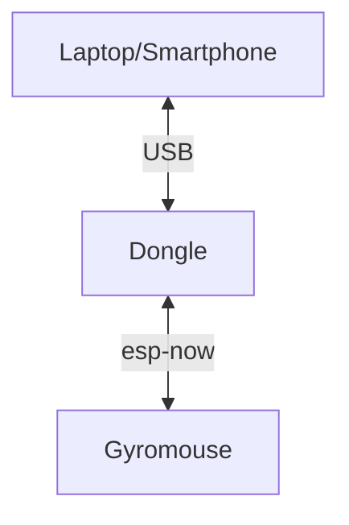

# Assistive device for using a computer without a mouse (gyromouse)

## Overview

This device is to help people use their co

## Features

The only supported feature currently allows the mouse pointer to move based on the user's head movements (up, down, left, and right).

## Where is supported

The dongle can be connected to devices such as Computers, Laptops, Tablets or Smartphones that support USB OTG. The device also works on Window

### Supported devices
|  Device type |  Does it work? |
|---|---|
|  Laptop / Computer | ✅ |
|  Tablet | ☑️ (only if the device supports USB OTG)  |
|  Smatphone |  ☑️ (only if the device supports USB OTG)|

### Supported Operating Systems
|  OS | Does it work? |
|---|---|
|Windows|✅|
|Linux|✅|
|Android|☑️ (cannot be configured)|
|MacOS|☑️ (not tested)|

### How its connected 

## Software for the host

Note: The device will work wthout this software

Requirments:
- Visual Studio 2026
- .net 8.0

Open the project in the `/GetStartedApp` folder
Set the startap project in Visual Studio to be StartedApp, and not GetStartedApp.Desktop.

## Software for the devices
Requirments:
- Visual Studio Code
- PltformIO extention

The code for the Dongle is located in the folder `/Dongle` folder

The code for the gyromouse is located in the folder `/Gyromouse` folder

Here is a generic tutorial on how to run PlatformIO projects.
[https://randomnerdtutorials.com/vs-code-platformio-ide-esp32-esp8266-arduino/](https://randomnerdtutorials.com/vs-code-platformio-ide-esp32-esp8266-arduino/)

## Hardware schematics

The schematics were made in KiCad and they can be found int `/HardwareSchematics` folder.

## 3D models

The 3D models can be found in `/3d models` folder.

The `gyro mouse casing v2.f3d` file is the Fusion 360 project file for the case design.

**The remaining STL files are individual parts of the case that need to be printed separately.**

All of the parts can be printed without support material and are already in the proper orientation 
for printing. The model "strap holder.stl" should be printed twice.

